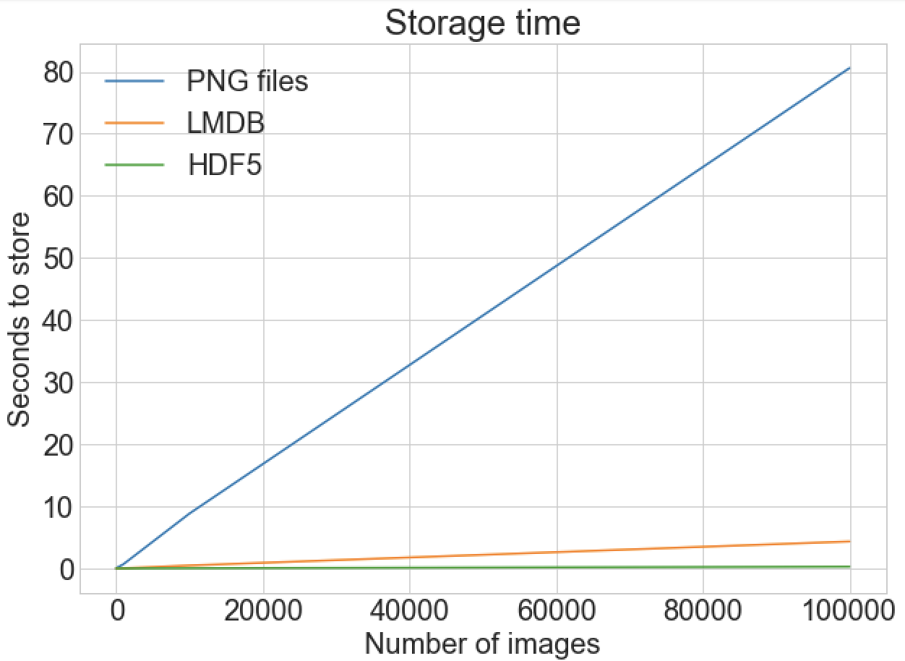
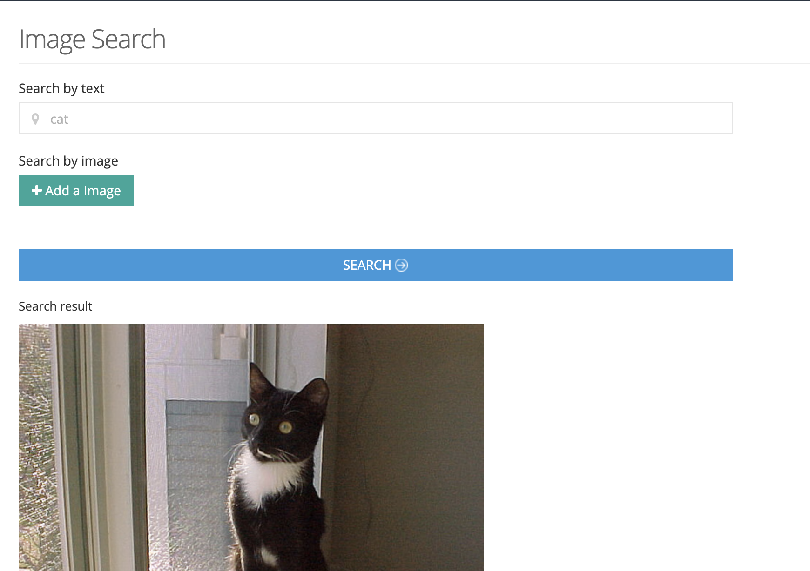
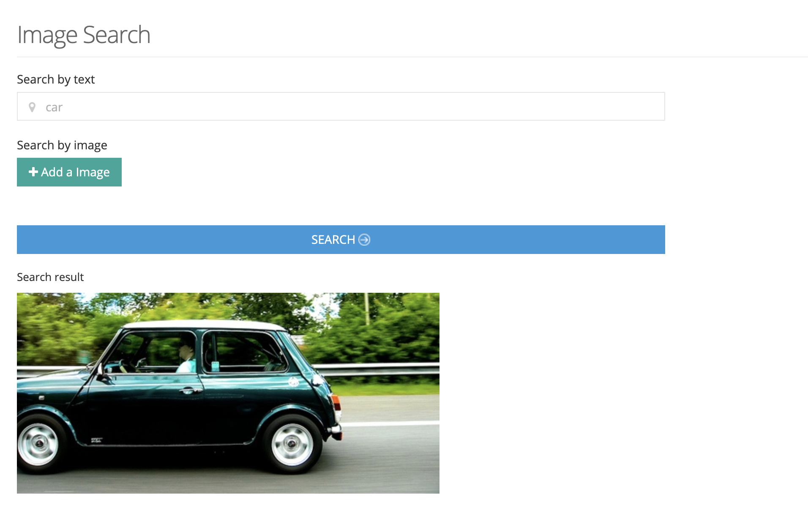
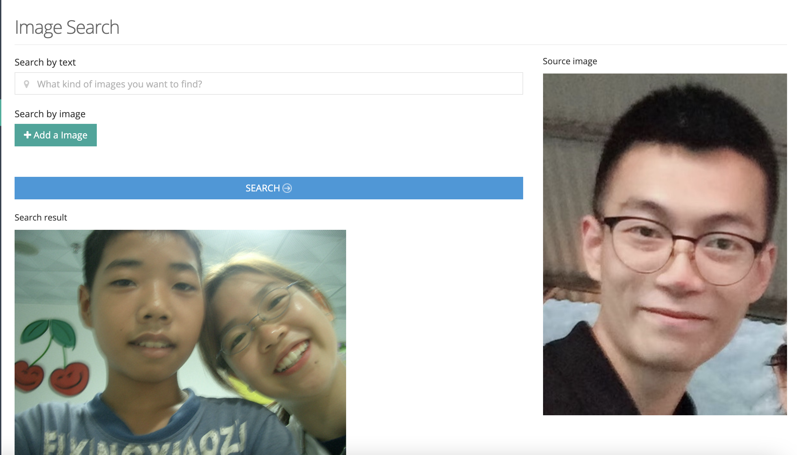
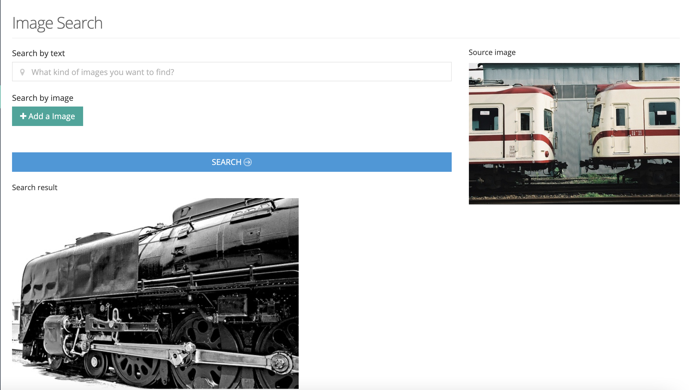
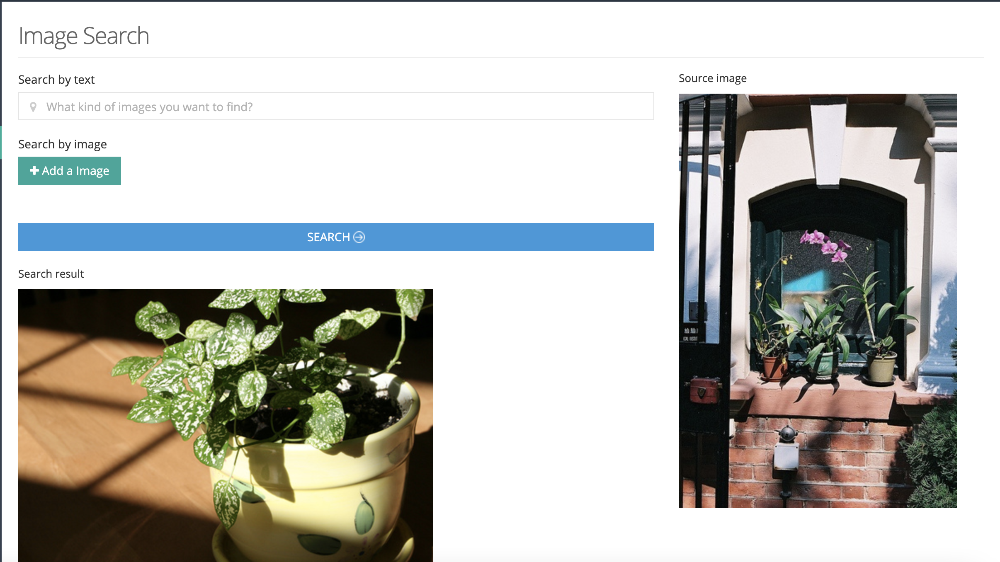

# Image Gallery

This project is built for `Winter 2022 - Shopify
Developer Intern Challenge Question`.  


## Run and Test
``` bash
# All images needed were uploaded by me.
# Copy the docker-compose.yaml and run 
# These are 3 images in this project.
# It may takes a while to download. 
docker-compose up -d
```


## Solution

### Part 1. Image Storage

Rather than using database recording the path of images stored in disk, this project used a single `HDF5` file to store image vectors (`ndarry` in `numpy`) due to it's high I/O efficiency.  
  

### Part 2. Feature extraction

When images are first uploaded, I used a object detection model called `SSD` to detect objects in the images. Each object can be presented by a 6D vector `(class_id, confidence, xmin, ymin, xmax, ymax)`. I used 20 objects (with highest confidence) in a image to present that image. So the shape of the `ssd_feature` of a image is `(20, 6)`. When the `ssd_feature` is generated, I stored it into the `ssd_feature_group` of the `h5` file.  After that, I constructed a sentence by the class name of objects in a image (each object has a class_id which corresponds a class_name). That sentence can be viewed as the text feature of a image. The sentence is then sent to a `word2vec` model to generate a feature vector called `nlp_feature` with the `shape = (50,)`. Then the `nlp_feature` is also stored in the `nlp_feature_group` of the `h5` file.


### Part 3. Finding the most similar image

#### Part 3.1 By search terms 

When we get the input search terms (or a sentence), we cloud use the same `word2vec` model to vectorize them. Then we can iterate the `nlp_feature_group` to find a most similar vector (by `cosine_similarity`) and return the corresponding raw image (this process may take some time `O(n)`, but if the image volume is not so huge, it's acceptable. It can be optimized in future).

#### Part 3.2 By image

When we get the input source image, we cloud use the `SSD` model to generate `ssd_feature` of the input image. Then we can also iterate the `ssd_feature_group` to find a most similar image feature. Here is the process to calculate similarity between two images:

```python 
def calc_cv_similarity_by_ssd_results(objs_1, objs_2, img_width=300, img_height=300):
    """
    k objects, each object is presented by: [class_No, confidence, xmin, ymin, xmax, ymax]
    the similarity is measured by the mean of
    (confidence_1 + confidence_2) / 2 and (bounding_box_1.area + bounding_box_2.area) / (img_width + img_height) / 2
    ps: I constructed the similarity between two images by myself. There is no too much explain to it.
    :param objs_1: shape = (k, 6)
    :param objs_2: shape = (k, 6)
    :return: a float number
    """
    EPS = 1e-5      # we assume a number less than 1e-5 equals 0
    similarity_sum = 0
    cnt = 0
    for obj_1 in objs_1:
        for obj_2 in objs_2:
            if not obj_1[0] == obj_2[0]:
                continue
            if obj_1[0] == 0:
                continue

            poly_1 = Polygon([(obj_1[2], obj_1[3]), (obj_1[4], obj_1[3]), (obj_1[4], obj_1[5]), (obj_1[2], obj_1[5])])
            poly_2 = Polygon([(obj_2[2], obj_2[3]), (obj_2[4], obj_2[3]), (obj_2[4], obj_2[5]), (obj_2[2], obj_2[5])])

            class_similiarity = (obj_1[1] + obj_2[1]) / 2
            area_similiarity = (poly_1.area + poly_2.area) / (img_width * img_height) / 2
            # iou = poly_1.intersection(poly_2).area / poly_1.union(poly_2).area

            # print(class_similiarity, area_similiarity, iou)

            # print(class_similiarity * area_similiarity)

            cur_similiarity = (class_similiarity + area_similiarity) / 2
            # cur_similiarity = class_similiarity * area_similiarity
            if cur_similiarity > EPS:
                cnt += 1
                similarity_sum += cur_similiarity

    return 0 if cnt == 0 else similarity_sum / cnt
```

## Deficiencies of this project

> 1. The `ssd_feature` and `nlp_feature` are generated when a image is first uploaded. This process takes a long time when there are many images in a single request. But this process can be optimized by 2 ways: 1) use asnyc function to generate and store feature. 2) use a gpu based object detection service to accelerate the `ssd_feature` generating process.  
> 2. Storing all images in a single `HDF5` file is not safe. It also brings problems of searching (we have to iterate the whole image set to find the most relevant image)  
> 3. Using object detection model to extract image feature can be **narrow-in-scope** since these model can only recognize the objects appeared in their training dataset. For example, the `SSD trained by COCO dataset` can only recognize 80 types of objects. Based on these model, we can **only** search images by recognized objects, which is also severely depending on the model's performance. Another point is that, the object class, confidence and coordinates are hard to be viewed as the determinative feature of a image. So, using these feature may return image which seems not so similar.


`TODO`  
- [x] Frontend pages design and implementation
- [x] File upload, save, display
- [x] Build docker image for tensorflow model server serving a SSD300 model  
- [x] Object detection model inference functions
- [x] Used HDF5 to store images
- [x] image feature extraction process when images are uploaded
- [x] NLP word2vec to implement image text searching 
- [x] Examples in README.md
- [x] Docker image for deployment 
- [ ] Multiple threads/async image upload
- [ ] Frontend beautify
- [ ] Code comments and beautify
- [ ] Detail document
- [ ] Optimization


Reference:
> Web pages templates: METRONIC https://keenthemes.com/metronic/  
> Image player in the dashboard: https://www.html5tricks.com/jquery-accordion-auto-image-player.html  
> SSD Kears: https://github.com/pierluigiferrari/ssd_keras  
> Image dataset: http://host.robots.ox.ac.uk/pascal/VOC/  


## Examples of image searching
  
  
  
  
  
